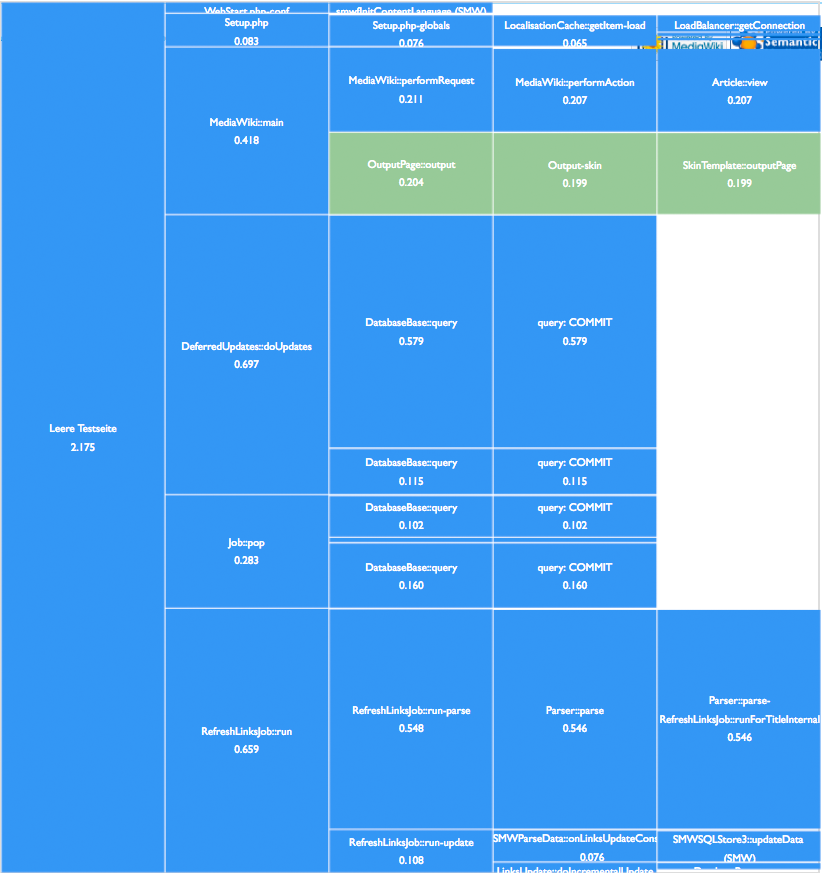

* [Video Introduction](#video-introduction)
* [Screenshot](#screenshot)
* [Installation](iInstallation)
* [Diagram examples](#diagram-examples)
* [License](#license)
* [Author](#author)

Have you ever asked yourself these questions?

* Where does my computing time go?
* What is slowing down my MediaWiki Extension?
* Is it the Code or the content?

Use this MediaWiki Extension to find out. It will show you detailed diagrams of which functions, classes, methods or content fractions (wikiScript!) are eating your performance.

# Video Introduction

Video: SMWCon Fall 2014 in Vienna, Achim Bode, Introducing Performance Monitor

<a href="https://www.youtube.com/watch?v=EmHoskE4hBo"></img></a>

# Screenshot

Screenshot Performance Monitor

For detailed diagrams that show the differences between different (e.g. cached and non-cached) scenarios, see the [Diagram examples](#diagram-examples) below.

# Installation

See <a href="https://www.mediawiki.org/wiki/Extension:PerformanceMonitor"> Extension:PerformanceMonitor</a> for detailed information on download and installation.

# Diagram examples

Result diagram 0: **Typical error detected, here a massive repetitive call problem**
</img>

Result diagram 1: **empty page for comparison**
</img>

Result diagram 2: **drilldown into Article:view**
</img>

Result diagram 3: **empty test page with sidebar cache**
</img>

Result diagram 4: **empty test page with sidebar cache**
</img>

Result diagram 5: **job-runrate reduced to 0, without cache**
</img>

Result diagram 6: **job-runrate reduced to 0, with resource-loader cache**
</img>

# License

<a href="https://www.gnu.org/licenses/gpl-2.0.html">GNU General Public License 2.0</a>

# Author

<a href="https://www.gnu.org/licenses/gpl-2.0.html">Joachim Bode</a> @ <a href="https://www.data-farms.com/">Data Farms GmbH</a> (Client: Volkswagen AG R&D, 2014)
